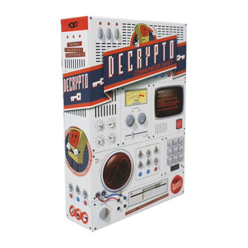

# DecryptoBoardGameBot

The bot for playing Decrypto board game, you must use it only to try how it works, then please buy the game itself ;)

**working**

1. fill .env

2. start project

```bash
docker-compose up
```

or

```bash
npm run dev
```

3. setup bot

```bash
curl https://api.telegram.org/bot<TELEGRAM_TOKEN>/setWebhook?url=https://europe-central2-zinovik-project.cloudfunctions.net/decrypto-board-game-bot?token=<TOKEN>
```

**testing**

```bash
curl --location 'localhost:8080'
```

```bash
curl https://api.telegram.org/bot<TOKEN>/setWebhook?url=https://<NGROK ID>.ngrok.io/index
~/ngrok http 8080
```

## google cloud setup

### create service accounts

```bash
gcloud iam service-accounts create github-actions
gcloud iam service-accounts create decrypto-board-game-bot
```

### add roles (`Service Account User` and `Cloud Functions Admin`) to the service account you want to use to deploy the function

```bash
gcloud projects add-iam-policy-binding zinovik-project --member="serviceAccount:github-actions@zinovik-project.iam.gserviceaccount.com" --role="roles/iam.serviceAccountUser"

gcloud projects add-iam-policy-binding zinovik-project --member="serviceAccount:github-actions@zinovik-project.iam.gserviceaccount.com" --role="roles/cloudbuild.builds.builder"

gcloud projects add-iam-policy-binding zinovik-project --member="serviceAccount:github-actions@zinovik-project.iam.gserviceaccount.com" --role="roles/viewer"
```

### creating keys for service account for github-actions `GOOGLE_CLOUD_SERVICE_ACCOUNT_KEY_FILE`

```bash
gcloud iam service-accounts keys create key-file.json --iam-account=github-actions@zinovik-project.iam.gserviceaccount.com
cat key-file.json | base64
```

### add access to secrets

```bash
gcloud projects add-iam-policy-binding zinovik-project --member="serviceAccount:decrypto-board-game-bot@zinovik-project.iam.gserviceaccount.com" --role="roles/secretmanager.secretAccessor"
```

### add secrets

```bash
printf "TELEGRAM_TOKEN" | gcloud secrets create decrypto-board-game-bot-telegram-token --locations=europe-central2 --replication-policy="user-managed" --data-file=-

printf "TOKEN" | gcloud secrets create decrypto-board-game-bot-app-token --locations=europe-central2 --replication-policy="user-managed" --data-file=-
```
